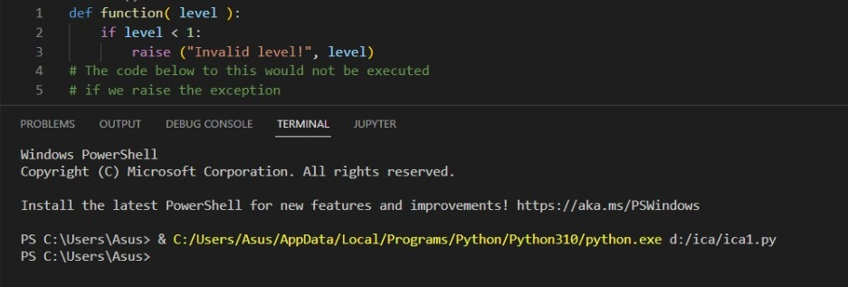

# praktikumm9
# pertemuan13 
```
NAMA    : KHAIRUNNISA NASUTION
NIM     : 312210026
KELAS   : TI.22.C1
MATKUL  : BAHASA PEMROGRAMAN
```

# APA ITU EXCEPTION HANDLING PADA PYTHON?
    - Exception (Eksepsi) merupakan sebuah peristiwa saat terjadinya kesalahan (error) pada program yang sedang dijalankan, kesalahan ini akan menyebabkan program berakhir dengan tidak normal.

# ASSERTION
    - Hampir sama seperti `if`. jika bernilai benar akan melanjutkan eksekusi pada kode. Dan jika salah maka akan raise error.

## Contoh 1
    - Berikut adalah fungsi yang mengubah suhu dari derajat kelvin menjadi derajat Fahrenheit. Karena nol derajat Kelvin sedingin itu, fungsi ditebus jika melihat suhu negatif.
    - Source code & Output dari contoh 1 :


# MENANGANI PENGECUALIAN
Jika Anda memiliki beberapa kode mencurigakan yang mungkin mengeluarkan pengecualian, Anda dapat mempertahankan program Anda letakkan kode yang mencurigakan di *try: blok. Setelah coba: blok, sertakan pernyataan sertakan *except: statemen, diikuti oleh blok kode yang menangani masalah seanggun mungkin.

## Contoh 2
    - Contoh dibawah ini untuk membuka file, menulis konten di file, dan keluar dengan anggun karena ada tidak masalah.
    - Source code & Output dari contoh 2 :


## Contoh 3
    - Contoh ini mencoba membuka file yang anda tidak memiliki izin menulis, sehingga menimbulkan pengecualian.
    - Source code & Output dari contoh 3 :


# KLAUSUL COBA-AKHIRNYA

## Contoh 4 & 5
    - Jika anda tidak memiliki izin untuk membuka file dalam mode penulisan, maka ini akan menghasilkan file sebagai berikut :


    - Contoh yang sama dapat ditulis lebih bersih sebagai berikut :


Ketika exception dilempar ke dalam blok try, eksekusi segera dilanjutkan ke akhir memblok. Setelah semua pernyataan di blok akhirnya dieksekusi, pengecualian dimunculkan lagi dan ditangani dalam pernyataan kecuali jika ada di lapisan berikutnya yang lebih tinggi dari percobaan-kecuali penyataan.

# ARGUMEN PENGECUALIAN

## Contoh 6
    - Berikut adalah contoh untuk satu pengecualian
    - Source code & Output dari contoh 6 :
)

## Contoh 7
    - Pengecualian dapat berupa string, kelas, atau objek. Sebagian besar pengecualian adalah pengecualian dari inti Python menimbulkan adalah kelas, dengan argumen=argumen yang merupakan turunan dari kelas. Mendefinisikan pengecualian barucukup mudah dan dapat dilakukan sebagai berikut:


## Pengecualian yang Ditetapkan Pengguna
    - Python juga memungkinkan Anda membuat pengecualian sendiri dengan menurunkan kelas-kelas dari yang standar pengecualian bawaan.
    - Berikut adalah contoh-contoh yang terkait dengan RuntimeError. Di sini, kelas dibuat yang merupakan subkelas dari subkelas RuntimeError. Ini berguna saat Anda perlumenampilkan tampilan informasi yang lebih spesifik saat e pengecualian tertangkap.
    - Di blok coba, pengecualian yang ditentukan pengguna dimunculkan dan ditangkap di blok kecuali. Itu variabel e digunakan untuk membuat instance dari kelas Networkerror.

## Contoh 8

